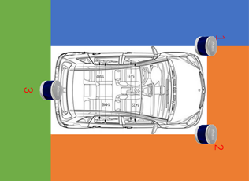
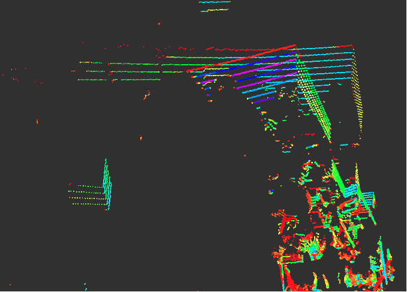
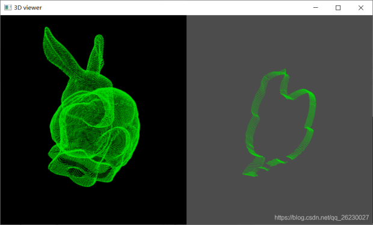
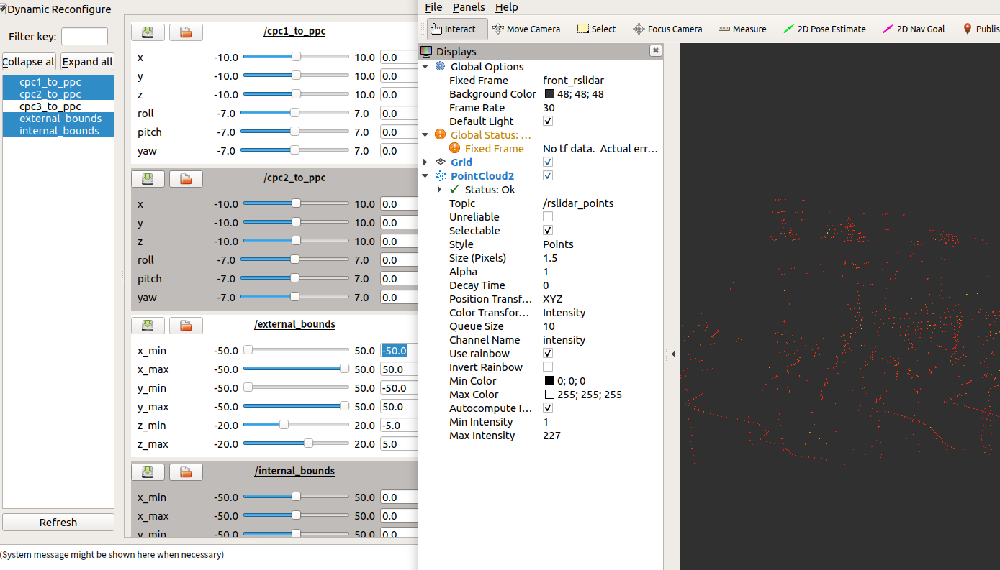

# Fusion_PointClouds - 多激光雷达点云数据融合
## 1. 简介
**fusion_pointclouds**  主要目的为Ubuntu环境下无人车多激光雷达标定之后， 将多个激光雷达点云话题/坐标系 通过PCL (Point Cloud Library)融合为 一个ros点云话题，以便于后期点云地面分割与地面处理等等。
### 1.1 应用场景
|图1：为了保证激光雷达的360°环境覆盖，我们需要用到多传感器的拼接|图2：只单纯融合激光雷达的信息，多激光雷达会发生重叠，因此需要点云坐标变换|
|--|--|
|||
|图3：激光雷达一定角度扫描车体本身，滤除车身周围干扰/遮挡点云，如图1白色区域，下图为pcl滤波效果图|图4：雷达外参标定不一定十分精确，滤波需要估计车体大小也需调整。结合rqt_reconfigure 模块实现在线动态参数微调|
|||
### 1.2 项目内容
**(1)点云的坐标变化；**  
**(2)通过PCL(Point Cloud Library)融合为一个点云话题；**  
**(3)通过条件滤波与直通滤波方式，可滤除车身周围干扰/遮挡点云与远处较弱点云；**  
**(4)结合ros系统中 rqt_reconfigure 模块实现在线动态参数微调。**  

## 2.依赖介绍-ROS
若需在ROS环境下使用雷达驱动，则需安装ROS相关依赖库
Ubuntu 16.04 - ROS kinetic desktop-full 
Ubuntu 18.04 - ROS melodic desktop-full （自带pcl-1.8，无需安装）
安装方式： 参考 http://wiki.ros.org
**如果安装了ROS kinetic desktop-full版或ROS melodic desktop-full版，那么兼容版本其他依赖库也应该同时被安装了，所以不需要重新安装它们以避免多个版本冲突引起的问题, 因此，强烈建议安装desktop-full版，这将节省大量的时间来逐个安装和配置库**。

## 3 编译 & 运行


**1.将 *fusion_pointclouds* 工程工作空间放入*src*文件夹内。**
```
git clone https://github.com/Hliu0313/fusion_pointclouds
```
**2.根据实际情况修改 *fusion_pointclouds/config/params.yaml*文件**  
```
样例：详细可下载程序，查看。
fusion_lidar_num: 3                                                      #融合 lidar 点云数量 2/3/4  
topics:                                                                                 #订阅 lidar 点云话题  
  parent_pc_topic: "/front/rslidar_points"  
  child_pc_topic1: "/back/rslidar_points"  
  child_pc_topic2: "/left/rslidar_points"  
  child_pc_topic3: "/front/rslidar_points"   
 
  fusion_pc_topic: "/rslidar_points"                       #融合后发布点云话题名称  
  fusion_pc_frame_id: "/front_rslidar"                 #融合后发布点云话题名称  
   
#注意  
```
**3.返回工作空间目录，执行以下命令即可编译&运行**  
```
catkin_make
source devel/setup.bash
```
 ① 只做点云tf变换、融合与滤波，不启动rqt_reconfigure
```
roslaunch fusion_pointclouds fusion_pointclouds.launch  
```
  ② 启动rqt_reconfigure
```
roslaunch fusion_pointclouds fusion_pointclouds.launch  set_params:=true
```

## 4 参数介绍
本工程只有一份参数文件 `params.yaml`， 储存于`fusion_pointclouds/config`文件夹内，配合`load_params.h `与`load_params.cpp `加载参数，方便随时修改。(参数配置介绍在参数文件中已经描述较为详细)

## 5.改进方向
    1.using PointCloud = pcl::PointCloud<pcl::PointXYZIR>;-点云包括带pcl::PointXYZIR，pcl::PointXYZI两种格式，设置自由切换入口，参考rslidar_sdk
    2.图像与激光雷达 动态可视化参数微调
    3.初次写笔记请多多见谅，未来会积极的向前辈大佬们学习！
